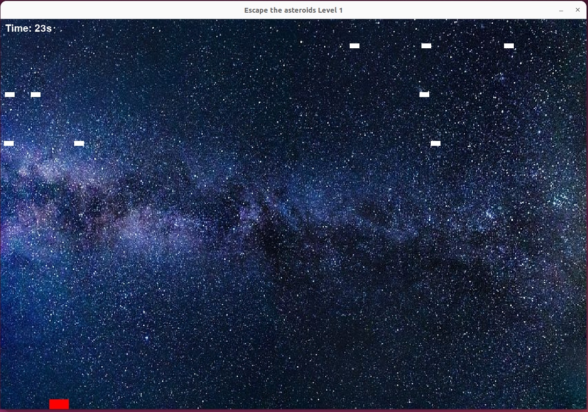

# escape_asteroid
# Asteroid Escape Game



## Description

Asteroid Escape is a simple game developed using Python and Pygame. The goal of the game is to control the player and avoid the falling asteroids for a certain duration to win the each level. The player can move left and right using the arrow keys to dodge the incoming asteroids.

## Features

- Multiple levels with increasing difficulty.
- Falling asteroids that the player must avoid.
- Timer to keep track of the remaining time to complete the level.
- Game-over screen when the player collides with an asteroid.

## How to Play

1. Clone the repository to your local machine.
2. Make sure you have Python and Pygame installed.
3. Run the game by executing `python3 escape_asteroid.py` in your terminal.

## Dependencies

- Run  
`pip3 install -r requirements.txt`

## Getting Started

Follow the instructions below to get a copy of the project and run it on your local machine.


### Installation

1. Clone the repository:

```bash
git https://github.com/Keshavraj024/escape_asteroid.git
cd escape_asteroid
```
## Screenshots
<!-- 

 -->
